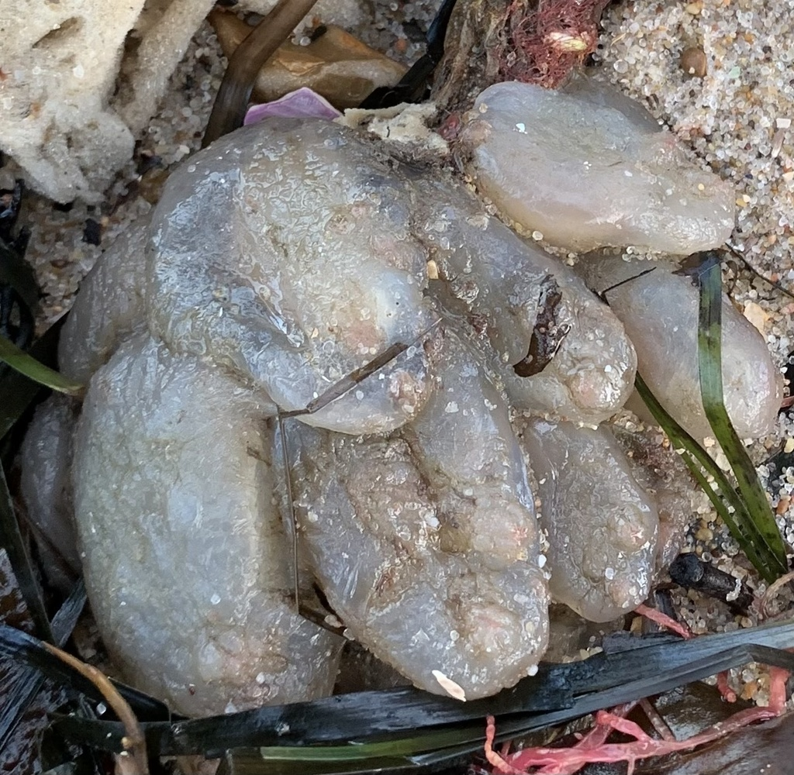

```{r, echo=FALSE}
pacman::p_load(rio, tidyverse, flexdashboard,   #load packages
          flextable, incidence2, epicontacts, DT, janitor, ggplot2, ggmap, leaflet)

occurrences = read_csv('occurrences.csv')
ascidians = read_csv('species.csv')
sites = read_csv('sites.csv') #import data
joinedtosites <- merge(x=occurrences, y=sites, by = "SITEID", all.x = TRUE)
```

# About this Site

The aim of this dashboard is to provide general information for anyone interested in understanding the distribution, biology, and identification of common biofouling species in the Northeastern United States from Long Island to Maine. 

If you have additional species you'd like to see added to this dashboard, please contact Dr. Linda Auker at linda.auker@gmail.com. 

This dashboard was created by:

Dr. Linda Auker, Certified Senior Ecologist (ESA)

Founder and Principal, Auker Ecological Services LLC, Shavertown, PA

Assistant Professor of Biology and Program Director of Environmental Studies, Misericordia University, Dallas, PA

# <i>Ascidiella aspersa</i> {data-navmenu="Species"}

## Column 1 {data-width="650"}

### <i>Ascidiella aspersa</i> occurrence

```{r}
ascidiella<-filter(joinedtosites, SpeciesID == "Aasp")

map <- leaflet() %>%
  addTiles() %>% #Add default OpenStreetMap tiles
  addMarkers(lng = ascidiella$lng, lat=ascidiella$lat, popup = paste(sep = "<br/>", ascidiella$Details, ascidiella$Source))

map
```

## Column 2 {.tabset data-width="350,"}

### Image of <i>Ascidiella aspersa</i>

```{r, echo=FALSE, fig.cap="<i>Ascidiella aspersa</i>. Photo credit: abumadsen (CC0 1.0.)", out.width = '50%'}

```

### Species information

From <a href = "https://invasions.si.edu/nemesis/species_summary/159213">SERC NEMESIS</a>: "<i>Ascidiella aspersa</i> is a solitary tunicate.
It is oval-shaped, wider near the base and narrower at the top where the
two siphons protrude, the oral siphon extends off the top and the atrial
siphon extends off the side about a third of the way down the body. It
grows up to 130 mm long and is usually attached on the posterior left
side. The siphons are short and conical (cone-shaped) and ridged with
8-10 branchial lobes and six atrial lobes. Papillae are scattered over
the body surface, especially on the right side and near the apertures.
The test (outer covering) is firm but thin, rough and gristly, gray,
black or brownish in color, and often with attached debris (Kott 1985,
Curtis 2005)."

From <a href = "https://www.marlin.ac.uk/species/detail/1566">Curtis (2005)</a>: "This species is solitary but commonly found in
dense unfused aggregations. The body is ovoid in shape, up to 130mm long
and usually attached to the substratum by the left side. The test or
layer that encloses the body is firm to touch, thick, rough and gristly,
and is greyish-black or brown in colour, often with attached detritus."

# <i>Botrylloides violaceous</i> {data-navmenu="Species"}

## Column 1 {data-width="650"}

### <i>Botrylloides violaceous</i> occurrence

```{r}
botrylloides<-filter(joinedtosites, SpeciesID == "Bvio")

map <- leaflet() %>%
  addTiles() %>% #Add default OpenStreetMap tiles
  addMarkers(lng = botrylloides$lng, lat=botrylloides$lat, popup = paste(sep = "<br/>", botrylloides$Details, botrylloides$Source))

map
```

## Column 2 {.tabset data-width="350,"}

### Image of <i>Botrylloides violaceous</i>

```{r, echo=FALSE, fig.cap="U.S. Geological Survey/photo by Dann Blackwood (USGS), Public domain, via Wikimedia Commons", out.width = '50%'}

```

### Species information

From <a href = "https://invasions.si.edu/nemesis/species_summary/-100">SERC NEMESIS</a>: "<i>Botrylloides violaceus</i> is a colonial
tunicate that can vary in color, ranging from purple, light lavender,
red, yellow, orange and brown. In all cases the colony is entirely one
color. <i>Botrylloides violaceus</i> colonies are encrusting, usually
2 - 3 mm in thickness (Saito et al. 1981) and can be large, up to 200 mm
x 20 mm. The tunic is soft, easily torn and the zooids are easily freed
from the tunic (Lambert 2003). Zooids are arranged in ladder-like
chains, with several common cloacal openings. Between chains of zooids
the tunic surface is sometimes elevated. Zooids have 10-11 rows of
stigmata and 9-12 stomach folds. Ova (reproductive cells) are located
dorsal-posterior to testis, consisting of up to 16 follicles. The larvae
of <i>B. violaceus</i> are incubated in the tunic. They are nourished by
the tunic vascular system and continue to grow even after the adult
zooid dies. The larvae are particularly large (up to 3 mm in length)
with 24-32 lateral ampullae (Saito et al. 1981; Nishikawa 1991; Lambert
2003). Fully developed larvae are released from the incubatory pouch via
the common cloacal openings (Saito et al. 1981)."

From <a href = "https://www.marlin.ac.uk/species/detail/2186">Snowden (2008)</a>: "<i>Botrylloides violaceus</i> is a colonial sea squirt forming lobed sheets usually 2-3 mm in thickness. Individual colonies are always one colour. The colonies can be different colours, e.g. dark brown, brick red, orange, purple or yellow. The zooids are arranged in a variety of ways, roughly oval groups or meandering, occasionally branching, double rows or chains."

# <i>Didemnum vexillum</i> {data-navmenu="Species"}

## Column 1 {data-width="650"}

### <i>Didemnum vexillum</i> occurrence

```{r}
didemnum<-filter(joinedtosites, SpeciesID == "Dvex")

map <- leaflet() %>%
  addTiles() %>% #Add default OpenStreetMap tiles
  addMarkers(lng = didemnum$lng, lat=didemnum$lat, popup = paste(sep = "<br/>", didemnum$Details, didemnum$Source))

map
```

## Column 2 {.tabset data-width="350,"}

### Image of <i>Didemnum vexillum</i>

```{r, echo=FALSE, fig.cap="Cricket Raspet, some rights reserved (CC BY)", out.width = '50%'}

```

### Species information

From <a href = "https://invasions.si.edu/nemesis/species_summary/-334">SERC NEMESIS</a>: "A colonial tunicate consists of many zooids,
bearing most or all of the organs of a solitary tunicate, but modified
to varying degrees for colonial life. Colonial tunicates of the family
Didemnidae have small zooids, completely embedded in an encrusting and
thin tunic. Each zooid has an oral siphon and an atrial aperture which
opens to a shared cloacal chamber. Water is pumped into the oral siphon,
through finely meshed ciliated gills on the pharynx, where phytoplankton
and detritus is filtered, and passed on mucus strings to the stomach and
intestines. Excess waste is expelled in the outgoing atrial water (Van
Name 1945; Barnes 1983)."

From <a href = "https://www.marlin.ac.uk/species/detail/2231">Gibson-Hall and Bilewitch (2018)</a><i>Didemnum vexillum</i> is a colonial sea squirt that can form large, leathery patches. The colonies are firm but thin (2-5 mm). The colonies themselves can become quite large owing to the fast growth of the species. It is possible to remove areas of a colony by simply peeling it from the substrata. If <i>Didemnum vexillum</i> grows on vertical or hanging surfaces the colonies can become long and dangling (pendulous) and even detach. The colonies are a single colour, from off-white to cream to a dull orange. Unlike some other colonial sea squirts, <i>Didemnum vexillum</i> lacks black and or/brown markings on its surface. Instead, it has a veiny appearance due to darker water channels within the colony. When contracted, every zooid shows a visible white spot marking the inhalant opening. Large cloacal openings (exit pores) occur at intervals.

# <i>Styela clava</i> {data-navmenu="Species"}

## Column 1 {data-width="650"}

### <i>Styela clava</i> occurrence

```{r}
styela<-filter(joinedtosites, SpeciesID == "Scla")

map <- leaflet() %>%
  addTiles() %>% #Add default OpenStreetMap tiles
  addMarkers(lng = styela$lng, lat=styela$lat, popup = paste(sep = "<br/>", styela$Details, styela$Source))

map
```

## Column 2 {.tabset data-width="350,"}

### Image of <i>Styela clava</i>

```{r, echo=FALSE, fig.cap="Cricket Raspet, some rights reserved (CC BY)", out.width = '50%'}

```

### Species information

From <a href = "https://invasions.si.edu/nemesis/species_summary/159337">SERC NEMESIS</a>: "<i>Styela clava</i> is a solitary tunicate with a
leathery, but thin, and bumpy tunic. Its body is cylindrical or
club-shaped and narrows posteriorly to a stalk that is anchored to the
substrata by a disk shaped holdfast. The wrinkled or creased looking
stalk is often 20-50% of the total body length. <i>Styela clava</i> can
grow up to 150 mm in length. Colors can range from yellowish to reddish
to brownish. The oral and atrial siphons are located close together and
are directed anteriorly. Both siphons have four lobes and appear striped
with alternating dark and light brownish to purplish bands (Kott 1985;
Nishikawa 1991; Lambert 2003)."

From <a href = "https://www.marlin.ac.uk/species/detail/1883">Neish (2007)</a>: "A solitary sea squirt with a long club-shaped body, tapering to a slender and tough stalk. The overall height of the sea squirt can reach 12cm and the stalk can be a 1/3 of the total length. The surface of the sea squirt can be leathery with folds and swellings. The siphons at the top (anterior) end are close together."

# Connecticut {data-navmenu="State"}

```{r}
ct<-filter(joinedtosites, state == "Connecticut")
pal<- colorFactor(c("yellow", "orange", "white", "red"), ct$SpeciesID)
map <- leaflet() %>%
  addTiles() %>% #Add default OpenStreetMap tiles
  addCircleMarkers(data = ct, lng = ~lng, lat=~lat, popup = paste(sep = "<br/>", ct$Details, ct$Source), fillColor = ~pal(ct$SpeciesID), fillOpacity = 0.9, color = "black", weight = 1) %>%
  addLegend('bottomright', colors = c("yellow", "orange", "white", "red"), values = ct$SpeciesID, labels = c("Ascidiella aspersa", "Botrylloides violaceous", "Didemnum vexillum", "Styela clava"), title = 'Ascidian Species', opacity = 1.0)
map
```

# Maine {data-navmenu="State"}

```{r}
me<-filter(joinedtosites, state == "Maine")
pal<- colorFactor(c("yellow", "orange", "white", "red"), ct$SpeciesID)
map <- leaflet() %>%
  addTiles() %>% #Add default OpenStreetMap tiles
  addCircleMarkers(data = me, lng = ~lng, lat=~lat, popup = paste(sep = "<br/>", me$Details, me$Source), fillColor = ~pal(me$SpeciesID), fillOpacity = 0.9, color = "black", weight = 1) %>%
  addLegend('bottomright', colors = c("yellow", "orange", "white", "red"), values = me$SpeciesID, labels = c("Ascidiella aspersa", "Botrylloides violaceous", "Didemnum vexillum", "Styela clava"), title = 'Ascidian Species', opacity = 1.0)
map
```

# Massachusetts {data-navmenu="State"}

```{r}
ma<-filter(joinedtosites, state == "Massachusetts")
pal<- colorFactor(c("yellow", "orange", "white", "red"), ma$SpeciesID)
map <- leaflet() %>%
  addTiles() %>% #Add default OpenStreetMap tiles
  addCircleMarkers(data = ma, lng = ~lng, lat=~lat, popup = paste(sep = "<br/>", ma$Details, ma$Source), fillColor = ~pal(ma$SpeciesID), fillOpacity = 0.9, color = "black", weight = 1) %>%
  addLegend('bottomright', colors = c("yellow", "orange", "white", "red"), values = ma$SpeciesID, labels = c("Ascidiella aspersa", "Botrylloides violaceous", "Didemnum vexillum", "Styela clava"), title = 'Ascidian Species', opacity = 1.0)
map
```

# New Hampshire {data-navmenu="State"}

```{r}
nh<-filter(joinedtosites, state == "New Hampshire")
pal<- colorFactor(c("yellow", "orange", "white", "red"), nh$SpeciesID)
map <- leaflet() %>%
  addTiles() %>% #Add default OpenStreetMap tiles
  addCircleMarkers(data = nh, lng = ~lng, lat=~lat, popup = paste(sep = "<br/>", nh$Details, nh$Source), fillColor = ~pal(nh$SpeciesID), fillOpacity = 0.9, color = "black", weight = 1) %>%
  addLegend('bottomright', colors = c("yellow", "orange", "white", "red"), values = nh$SpeciesID, labels = c("Ascidiella aspersa", "Botrylloides violaceous", "Didemnum vexillum", "Styela clava"), title = 'Ascidian Species', opacity = 1.0)
map
```

# New York {data-navmenu="State"}

```{r}
ny<-filter(joinedtosites, state == "New York")
pal<- colorFactor(c("yellow", "orange", "white", "red"), ny$SpeciesID)
map <- leaflet() %>%
  addTiles() %>% #Add default OpenStreetMap tiles
  addCircleMarkers(data = ny, lng = ~lng, lat=~lat, popup = paste(sep = "<br/>", ny$Details, ny$Source), fillColor = ~pal(ny$SpeciesID), fillOpacity = 0.9, color = "black", weight = 1) %>%
  addLegend('bottomright', colors = c("yellow", "orange", "white", "red"), values = ny$SpeciesID, labels = c("Ascidiella aspersa", "Botrylloides violaceous", "Didemnum vexillum", "Styela clava"), title = 'Ascidian Species', opacity = 1.0)
map
```

# Rhode Island {data-navmenu="State"}

```{r}
ri<-filter(joinedtosites, state == "Rhode Island")
pal<- colorFactor(c("yellow", "orange", "white", "red"), ri$SpeciesID)
map <- leaflet() %>%
  addTiles() %>% #Add default OpenStreetMap tiles
  addCircleMarkers(data = ri, lng = ~lng, lat=~lat, popup = paste(sep = "<br/>", ri$Details, ri$Source), fillColor = ~pal(nh$SpeciesID), fillOpacity = 0.9, color = "black", weight = 1) %>%
  addLegend('bottomright', colors = c("yellow", "orange", "white", "red"), values = ri$SpeciesID, labels = c("Ascidiella aspersa", "Botrylloides violaceous", "Didemnum vexillum", "Styela clava"), title = 'Ascidian Species', opacity = 1.0)
map
```

# Getting Started {data-navmenu="Panel Tutorial"}

**Photographing panels**

1.  Photograph both sides of each panel clearly. The more light
    available and the closest you can get to the panel without cropping
    it out will make it easier to analyze. Use the highest resolution on
    your smartphone or digital camera.

2.  Suggested labeling for each photo includes depth_side_replicate. So
    a shallow panel front might be Shallow_front_1, and the other side
    of the panel is Shallow_back_1.

3.  Download ImageJ, a free open-source image analysis software
    available from NIH, at
    <https://imagej.nih.gov/ij/download.html>.

4.  Open the program. Go to File > Open and find your photograph in the
    directory. Once you open your photograph, zoom in or out as needed
    to ensure the entire panel is visible on your screen and you are
    able to see the organisms clearly.

# Analysis of Community Settlement Panels in Image J {data-navmenu="Panel Tutorial"}

Option 1: 

1.  Set the scale of your image. First, choose the "Straight Line" shape
    and draw a line along one edge of your panel.


Next, go to Analyze > Set Scale... . In the dialog box, the program
gives you the distance in pixels of the line you have drawn. In "Known
distance" enter the length of the panel (10) and in "Unit of length"
enter the units used (cm). Click ok.

2.  Now you can start analyzing your panel photograph. Click freehand
    selection (Figure 2). Carefully, with your mouse, draw a line around
    a colony. Try to get as close to the edges as you can (Figure 3). If
    you make an error, let go of the mouse, left-click on the photograph
    and your line will disappear and you can try again. Now, go to
    Analyze > Measure. Under Area you will see the area your drawn line
    covers. This is the area, of your colony.


3.  Repeat step 2 with a different colony. Notice that if you didn't
    close the "Results" dialog box, your first measurements are still
    there.

4.  Repeat until you have measured all species on the panel.

5.  It's very likely you will have more than one colony of the same
    species, or more than one area value for the same species. Make sure
    to add these up before recording on your spreadsheet for analysis.
    For example, for one colony of <i>Botrylloides violaceous</i>, you may
    have an area value of 4.35. For another colony of this species, the
    area is 1.53. Therefore, the total area is 5.88.

**Recording data in a spreadsheet**

Record your data in a spreadsheet. You will want to include Date, Panel
number and identification, side, depth, species, and area for variables.
Figure 4 below shows a suggested format for data entry. (DMC = Darling
Marine Center)


Option 2: using a grid to count percent cover of organisms 

Pros: Faster processing. 
Cons: With a sparsely populated panel, some species may be missed.

No matter what you use to count your species, be sure to save your spreadsheet as a .csv file before analyzing your data.

# Visualize your data using our Shiny app {data-navmenu="Panel Tutorial"}

If you follow the data format in the previous tutorial steps (Figure 4), you can upload it to <a href = "https://mercymatters.shinyapps.io/DashboardTest/">this Shiny app </a> to create a data visualization that you can screenshot or download for your own records. Follow the instructions below:

1) Be sure that you have a .csv (comma delimited) file ready for upload.

2) Navigate to the app link above.

3) Under "Choose CSV file", click Browse and navigate to where your .csv file has been stored. Click OK once you have chosen the file saved to your local hard drive. If you are successful, you will see a preview of your data and a graph appear. 

4) Ensure that Header is checked if you have column titles in your file.

5) Under outcome variable, choose "Area" and under predictor variable, choose "Species". Leave the settings as the default. You can now use the settings in the upper right corner of the image to pan, zoom, toggle, and save the file.

# SK Scallop Biofoulers

These data were collected as part of a NOAA Saltonstall Kennedy Grant.

To observe biofouling species collected as part of a NOAA Saltonstall Kennedy Grant awarded to Dr. Damien Brady at the University of Maine, check out the <a href = "https://arcgis.com/apps/dashboards/d4a1559572cf45769bcc641b3d3d73d1"> ArcGIS Dashboard at this link.</a> The locations shown in this dashboard are limited to scallop farms in the Maine coastal region and show temporal and spatial change in biofouling abundance.

For this project, we used 10x10cm Whitlatch panels (pictured below) at two depths to collect biofoulants on a monthly basis at four different scallop farms.

For more information about <a href = "https://umaine.edu/aquaculture/project/optimizing-production-and-products-for-scallop-aquaculture/">this project</a>, see some of the resulting research output:

Struan Coleman, Dana Morse, W. Christian Brayden & Damian C. Brady (2021): Developing a bioeconomic framework for scallop culture optimization and product development, Aquaculture Economics & Management, DOI: 10.1080/13657305.2021.2000517 <a href = "https://www.tandfonline.com/doi/full/10.1080/13657305.2021.2000517">link</a>

or contact <a href="mailto:dana.morse@maine.edu">Dana Morse</a>, University of Maine Sea Grant Extension.

You may also want to check out <a href="https://youtu.be/KhZwlQem1vA"> this webinar </a> given at the First Misericordia Ocean Sustainability Symposium by Dana Morse and Linda Auker. The talks within are on *Biofouling and the Maine Shellfish Farming Industry* and *Using GIS to Communicate Biofouling in Aquaculture.*

# References

```{r setup, include=FALSE}
library(flexdashboard)
```

Auker, L.A. 2019. A decade of invasion: changes in the distribution of <i>Didemnum vexillum</i> Kott, 2002 in Narragansett Bay, Rhode Island, USA, between 2005 and 2015. <i>BioInvasions Records</i> 8(2): 230-241. https://www.reabic.net/journals/bir/2019/2/BIR_2019_Auker.pdf 

Auker, L.A., Oviatt, C.A. 2008. Factors influencing the recruitment and abundance of <i>Didemnum</i> in Narragansett Bay, Rhode Island. <i>ICES Journal of Marine Science</i> 65(5): 765-769. https://academic.oup.com/icesjms/article/65/5/765/712427

Barnes, R.D. (1983) <i>Invertebrate Zoology</i>. Saunders, Philadelphia. pp. 883 

Berger, M.S., Whitlatch, R. 1997. The ecology of an introduced ascidian in Long Island Sound, In:<i>25th Annual Benthic Ecology Meeting</i>, Portland, Maine: 24 

Berman, J., Harris, L., Lambert, W., Buttrick, M., Dufresne, M. 1992. Recent invasions of the Gulf of Maine: Three contrasting ecological histories. <i>Conservation Biology</i> 6(3): 435-441. 

Blezard, D.J. 1999. Salinity as a refuge from predation in a nudibranch-hydroid relationship within the Great Bay Estuary system. MS Thesis. University of New Hampshire, Durham, NH.

Bullard, S.G., Lambert, G., Carman, M.R., Byrnes, J., Whitlatch, R.B., Ruiz, G., Miller, R.J., Harris, L., Valentine, P.C., Collie, J.S., Pederson, J., McNaught, D.C., Cohen, A.N., Asch, R.G., Dijkstra, J., Heinonen, K. (2007) The colonial ascidian <i>Didemnum</i> sp. A: Current distribution, basic biology and potential threat to marine communities of the northeast and west coasts of North America. <i>Journal of Experimental Marine Biology and Ecology</i> 342: 99-108. 

Carlton, J.T. 1989. Man's role in changing the face of the ocean: biological invasions and implications for conservation of near-shore environments. <i>Conservation Biology</i> 3(3): 265-273.

Carman, M.R., Hoagland, K.E., Green-Beach, E., Grunden, D.W. 2009. Tunicate faunas of two North Atlantic-New England islands: Martha’s Vineyard, Massachusetts and Block Island, Rhode Island. <i>Aquatic Invasions</i> 4(1): 65-70. 

Curtis, L. 2005. <i>Ascidiella aspersa</i> Fluted sea squirt. In Tyler-Walters
H. and Hiscock K. <i>Marine Life Information Network: Biology and Sensitivity Key Information Reviews</i>, [on-line]. Plymouth: Marine Biological Association of the United Kingdom. [cited 27-07-2023]. Available from: <https://www.marlin.ac.uk/species/detail/1566>

Gibson-Hall, E & Bilewitch, J. 2018. <i>Didemnum vexillum</i> The carpet sea squirt. In Tyler-Walters H. and Hiscock K. <i>Marine Life Information Network: Biology and Sensitivity Key Information Reviews</i>, [on-line]. Plymouth: Marine Biological Association of the United Kingdom. [cited 27-07-2023]. Available from: <https://www.marlin.ac.uk/species/detail/2231>

Kott, P. 1985. The Australian Ascidiacea Part 1, Phlebobranchia and Stolidobranchia. <i>Memoirs of the Queensland Museum</i> 23: 1-440.

Lambert, G. 2003. New records of ascidians from the NE Pacific: a new species of <i>Tridemnum</i>, range extension and description of <i>Aplidiopsis pannosum</i> (Ritter, 1899), including its larva, and several non-indigenous species. <i>Zoosystema</i> 24(4): 665-675. 

Lazzeri, K., Auker, L.A. 2022. The role of invasion status and taxon of basibionts in marine community structure. <i>Frontiers in Ecology and Evolution</i> 10, https://www.frontiersin.org/articles/10.3389/fevo.2022.806328/full.

Martin, J.L., LeGresley, M.M., Thorpe, B., McCurdy, P. 2011. Non-indigenous tunicates in the Bay of Fundy, eastern Canada (2006-2009). <i>Aquatic Invasions</i> 6(4): 405-412.

Massachusetts Institute of Technology (MIT) Sea Grant Rapid Assessment Surveys:

1) Pederson, J., Bullock, R, Carlton, J, Dijkstra, J, Dobroski, N, Dyrynda, P, Fisher, R, Harris, L, Hobbs, N, Lambert, G, Lazo-Wasem, E, Mathieson, A, Miglietta, M-P, Smith, J, Smith, J III, Tyrrell, M. 2005. Marine Invaders in the Northeast: rapida assessment survey of non-native and native marine species of floating dock communities. MIT Sea Grant College Program, Cambridge, Massachusetts. 40 pp.

2) McIntyre CM, Pappal AL, Bryant J, Carlton JT, Cute K, Dijkstra J, Erickson R, Garner Y, Gittenberger A, Grady SP, Haram L, Harris L, Hobbs NV, Lambert CC, Lambert G, Lambert WJ, Marques AC, Mathieson AC, McCuller M, Mickiewicz M, Pederson J, Rock-Blake R, Smith JP, Sorte C, Stefaniak L, and Wagstaff M. 2013. Report on the 2010 Rapid Assessment Survey of Marine Species at New England Floating Docks and Rocky Shores. Commonwealth of Massachusetts, Executive Office of Energy and Environmental Affairs, Office of Coastal Zone Management, Boston, Massachusetts. 35 pp.

Neish, A.H. 2007. <i>Styela clava</i> Leathery sea squirt. In Tyler-Walters H. and Hiscock K. <i>Marine Life Information Network: Biology and Sensitivity Key Information Reviews</i>, [on-line]. Plymouth: Marine Biological Association of the United Kingdom. [cited 27-07-2023]. Available from: <https://www.marlin.ac.uk/species/detail/1883>

Nishikawa, T. 1991. The ascidians of the Japan Sea. <i>Publications of the Seto Marine Biological Laboratory</i> 35: 25-170 

Osman, R.W., Whitlatch, R.B. 2007. Variation in the ability of Didemnum sp to invade established communities. <i>Journal of Experimental Marine Biology and Ecology</i> 342: 40-53.

Plough, H.H. 1978. <i>Sea squirts of the Atlantic Continental Shelf from Maine to Texas.</i> The Johns Hopkins University Press. 128 pp.

Saito, Y., Mukai, H., Watanabe, H. 1981. Studies on Japanese compound styelid ascidians II. A new species of the genus <i>Botrylloides</i> and redescription of <i>B. violaceus</i> Oka., <i>Publications of the Seto Marine Biological Laboratory</i> 26: 357-368 

Snowden, E. 2008. <i>Botrylloides violaceus</i> A colonial sea squirt. In Tyler-Walters H. and Hiscock K. (eds) <i>Marine Life Information Network: Biology and Sensitivity Key Information Reviews</i>, [on-line]. Plymouth: Marine Biological Association of the United Kingdom. [cited 27-07-2023]. Available from: <https://www.marlin.ac.uk/species/detail/2186>

Trott, T.J. 2004. Cobscook Bay inventory: a historical checklist of marine invertebrates spanning 162 years. <i>Northeastern Naturalist</i> 11(Special issue 2): 261-324. 

USGS Woods Hole Science Center 2003-2007. <a href="https://web.archive.org/web/20060206090117/http://woodshole.er.usgs.gov/project-pages/stellwagen/didemnum/"Marine nuisance species.</a> [Archived]

Van Name, W.G. 1945. The North and South American ascidians. <i>Bulletin of the American Museum of Natural History</i> 84: 1-462. 

Whitlatch, R.B., Osman, R. 2000. Geographical distributions and organism-habitat associations of shallow water introduced marine fauna in New England., In: Pederson, Judith (Ed.) <i>Marine Bioinvasions</i>, Cambridge MA.: 61-65